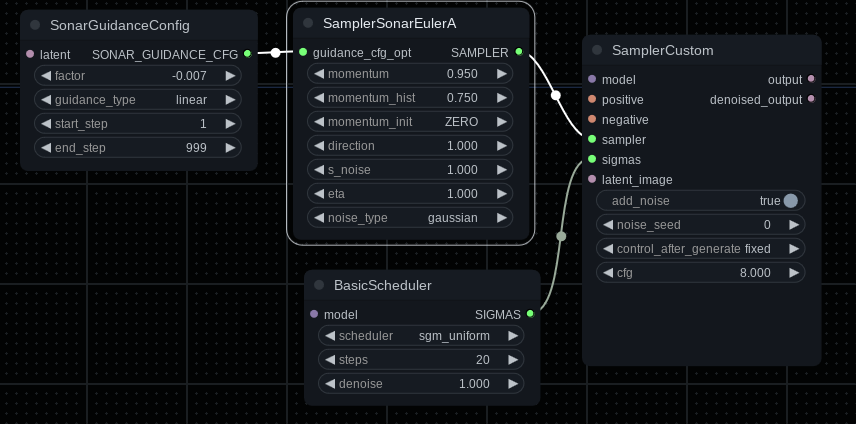

# ComfyUI-sonar

Extremely WIP and untested implementation of Sonar sampling for [ComfyUI](https://github.com/comfyanonymous/ComfyUI). Currently it may not be even close to working _properly_ but it does produce pretty reasonable results.

Only supports Euler and Euler Ancestral sampling.

## Description

See https://github.com/Kahsolt/stable-diffusion-webui-sonar for a more in-depth explanation.

The `direction` parameter should (unless I screwed it up) work like setting sign to positive or negative: `1.0` is positive, `-1.0` is negative. You can also potentially play with fractional values.

Like the original documentation says, you normally would not want to set `momentum` to a value below `0.85`. The default values are considered reasonable, doing stuff like using a negative direction may not produce good results.

## Usage

The most flexible way to use this is with a custom sampler:

You can also just choose `sonar_euler` or `sonar_euler_ancestral` from the normal samplers list (will use the default settings). I personally recommend using the custom sampler approach and the ancestral version.

## Parameters

Very abbreviated section. The init type can make a big difference. If you use `RANDOM` you can get away with setting `direction` to high values (like up to `2.25` or so) and absurdly low values (like `-30.0`). It's also possible to set `momentum` and `momentum_hist` to negative values, although whether it's a good idea...

## Noise

I basically just copied a bunch of noise functions without really knowing what they do. The main thing I can say is they produce a semi-reasonable result and it's different from the other noise samplers. See credits below.

1. `gaussian`: This is the default noise type.
2. `uniform`: Might enhance background details?
3. `brownian`: This is the noise type SDE samplers use.
4. `perlin`
5. `studentt`: There's a comment that says it may enhance subject details. It seemed to produce a fairly dark result.
6. `studentt_test`: An experiment that may be removed, it doesn't seem to be adding enough noise. You can possibly compensate by increasing `s_noise`.
7. `pink`
8. `highres_pyramid`: Not extensively tested, but it is slower than the other noise types. I would guess it does something like enhance details.

You can scroll down to the the examples section near the bottom to see some example generations with different noise types.

## Credits

Original Sonar Sampler implementation (for A1111): https://github.com/Kahsolt/stable-diffusion-webui-sonar

My version basically just rips off this Sonar sampler implementation for Diffusers: https://github.com/alexblattner/modified-euler-samplers-for-sonar-diffusers/

Noise generation functions copied from https://github.com/Clybius/ComfyUI-Extra-Samplers with only minor modifications. I may have broken some of them in the process _or_ they may not have been suitable for use and I took them anyway. If they don't work it is not a reflection on the original source.

## Examples

### Noise Types (img2img)

These were generated with `s_noise=1.05` to make the noise effect more pronounced, 30 steps at `0.66` denoise, sonar settings increased slightly to enhance the effect (`momentum=0.9, momentum_hist=0.85, direction=1.0, momentum_init=ZERO`). It is probably easier to compare using these as the image _mostly_ stays the same as the sonar sampler settings change.

Expand renoise example images

#### Base

Base image - no Sonar Sampler steps.

#### Euler A

Normal (non-sonar) Eular A. Not really a comparison with noise (think it would use gaussian) but with the difference in effect from momentum.

#### Gaussian

#### Brownian

#### Perlin

#### Uniform

#### Highres Pyramid

#### Pink

#### StudentT

#### StudentT_test

### Noise Types (Initial Generations)

These were generated with `s_noise=1.1` to make the noise effect more pronounced, default sonar settings (`momentum=0.95, momentum_hist=0.75, direction=1.0, momentum_init=ZERO`). It may be harder to see the noise effects since the composition can change a lot in initial generations.

Expand initial generation example images

#### Gaussian

#### Brownian

#### Perlin

#### Uniform

#### Highres Pyramid

#### Pink

#### StudentT

#### StudentT_test

